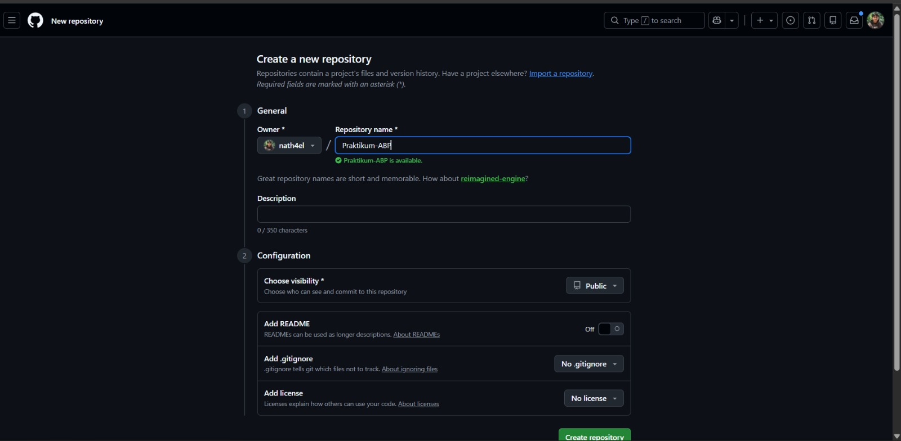
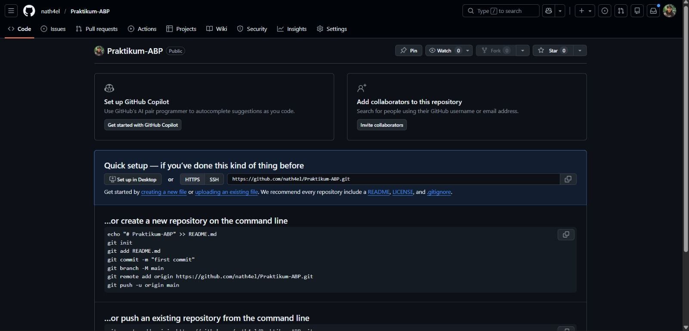
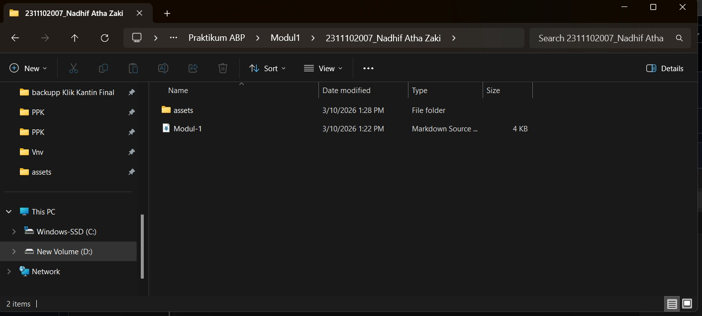
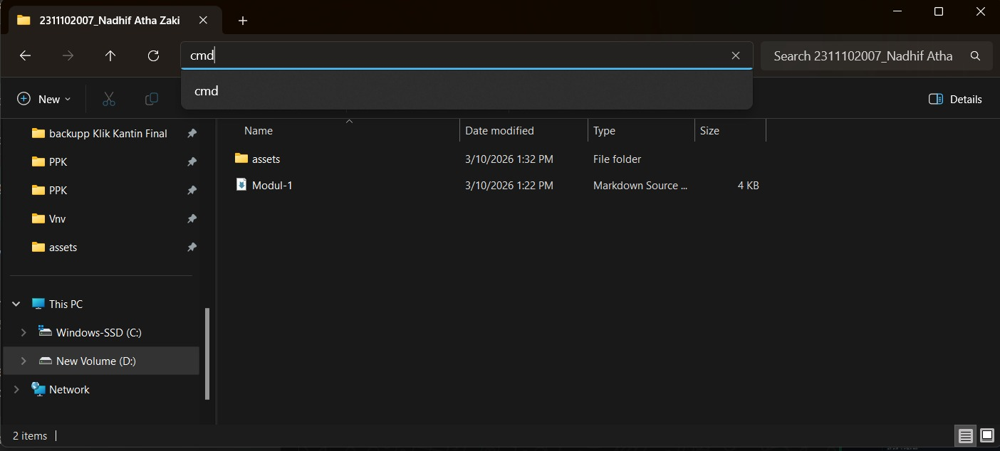
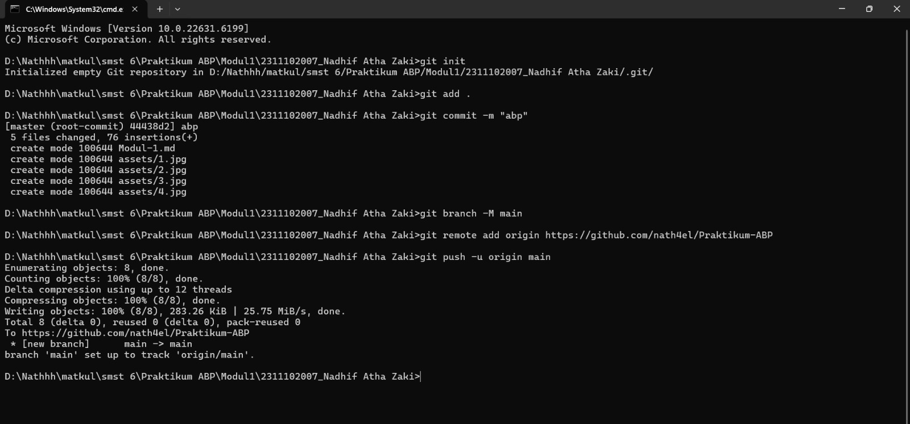
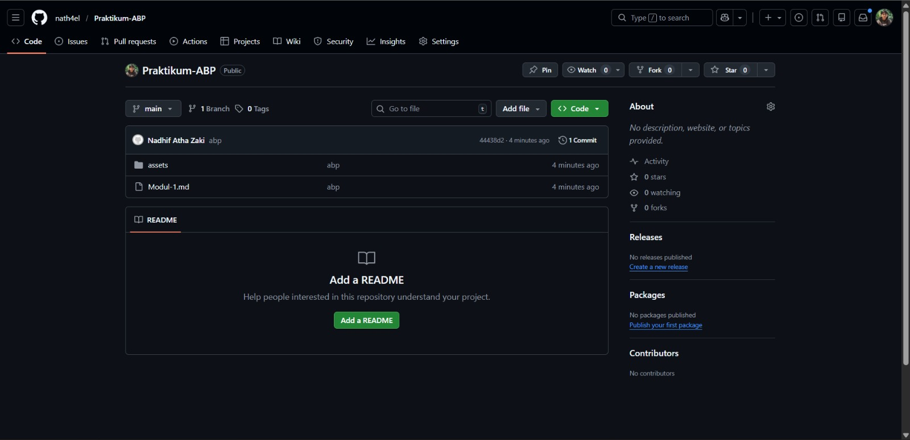



   
  <h1>LAPORAN PRAKTIKUM  APLIKASI BERBASIS PLATFORM</h1>
   
  <h3>MODUL 1   GIT</h3>
   
   
   
   
   
  <h3>Disusun Oleh :</h3>
  

    <strong>Nadhif Atha Zaki</strong> 
    <strong>2311102007</strong> 
    <strong>S1 IF-11-01</strong>
  

   
  <h3>Dosen Pengampu :</h3>
  

    <strong>Dimas Fanny Hebrasianto Permadi, S.ST., M.Kom</strong>
  

   
   
    <h4>Asisten Praktikum :</h4>
    <strong> Apri Pandu Wicaksono </strong>  
    <strong>Rangga Pradarrell Fathi</strong>
   
  <h3>LABORATORIUM HIGH PERFORMANCE
  FAKULTAS INFORMATIKA  UNIVERSITAS TELKOM PURWOKERTO  2026</h3>

---

## 1. Dasar Teori

**Git** adalah sistem pengontrol versi (Version Control System) terdistribusi yang sangat berguna bagi para pengembang perangkat lunak untuk melacak perubahan riwayat file dan mempermudah kolaborasi kode. Sedangkan **GitHub** adalah platform layanan hosting berbasis web untuk repositori Git yang memudahkan kita menyimpan proyek secara online.

**Command Line Interface (CLI)** adalah antarmuka teks di mana pengguna dapat mengetikkan perintah langsung untuk berinteraksi dengan sistem komputer. Dalam praktikum ini, kita menggunakan CLI (seperti Command Prompt atau Terminal) untuk mengeksekusi perintah-perintah Git dengan lebih cepat dan efisien.

---

## 2. Setup Repository via CLI

Berikut adalah urutan langkah-langkah untuk melakukan inisialisasi dan setup repositori dari lokal ke GitHub melalui CLI:

### Langkah 1: Membuat Repositori Baru di GitHub

Tahap awal yang dilakukan adalah membuat sebuah repositori baru pada platform GitHub. Repositori ini berfungsi sebagai tempat penyimpanan proyek secara online sehingga kode yang kita buat dapat disimpan, dikelola, serta diakses melalui internet.

### Langkah 2: Panduan Perintah Git

Setelah repositori berhasil dibuat, GitHub akan menampilkan panduan berisi beberapa perintah Git yang perlu dijalankan. Perintah-perintah tersebut digunakan untuk menghubungkan proyek yang ada di komputer lokal dengan repositori yang telah dibuat di GitHub.

### Langkah 3: Membuat Folder Proyek dan File

Pada tahap ini, kita membuat sebuah folder proyek di komputer lokal. Di dalam folder tersebut kemudian ditambahkan nantinya akan diunggah ke repositori.
### Langkah 4: Membuka CMD dari Direktori Folder Proyek

Selanjutnya, buka Command Prompt (CMD) atau Terminal dan pastikan direktori yang aktif berada pada folder proyek yang telah dibuat sebelumnya. Hal ini penting agar seluruh perintah Git yang dijalankan akan diterapkan pada folder proyek yang benar.

### Langkah 5: Menjalankan Perintah Git di Terminal (Push ke GitHub)

Pada langkah ini, jalankan perintah-perintah Git sesuai panduan yang diberikan oleh GitHub. Proses dimulai dengan menginisialisasi repositori lokal menggunakan git init, menambahkan file menggunakan git add, membuat commit menggunakan git commit, menghubungkan repositori lokal dengan repositori GitHub melalui remote, kemudian mengunggah file menggunakan git push.

### Langkah 6: Repositori Berhasil Diperbarui

Cek pada repository di github apakah file yang tadi di push sudah muncul

## Refrensi
- [Materi Modul 1](https://drive.google.com/file/d/1sAJR4AconN_aZjvLF-GTY0DM-e84pL63/view?usp=sharing)