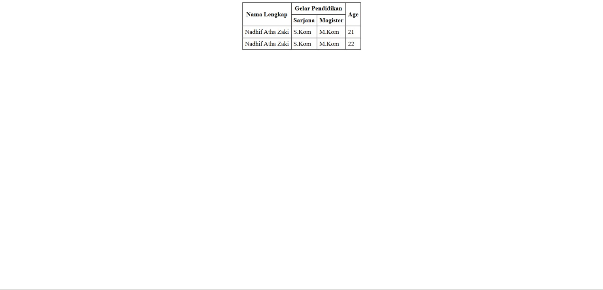

<div align="center">
  <br />
  <h1>LAPORAN PRAKTIKUM <br>APLIKASI BERBASIS PLATFORM</h1>
  <br />
  <h3>MODUL 2 <br> HTML</h3>
  <br />
  <br />
   
  <br />
  <br />
  <br />
  <h3>Disusun Oleh :</h3>
  <p>
    <strong>Nadhif Atha Zaki</strong><br>
    <strong>2311102007</strong><br>
    <strong>S1 IF-11-01</strong>
  </p>
  <br />
  <h3>Dosen Pengampu :</h3>
  <p>
    <strong>Dimas Fanny Hebrasianto Permadi, S.ST., M.Kom</strong>
  </p>
  <br />
  <br />
    <h4>Asisten Praktikum :</h4>
    <strong> Apri Pandu Wicaksono </strong> <br>
    <strong>Rangga Pradarrell Fathi</strong>
  <br />
  <h3>LABORATORIUM HIGH PERFORMANCE
 <br>FAKULTAS INFORMATIKA <br>UNIVERSITAS TELKOM PURWOKERTO <br>2026</h3>
</div>

---

## 1. Dasar Teori

HTML (HyperText Markup Language) merupakan bahasa markah standar yang digunakan untuk membangun struktur dasar sebuah halaman web. HTML bekerja dengan menggunakan kumpulan tag atau elemen yang tersusun secara bertingkat (*nested elements*). Tag tersebut memberikan instruksi kepada *web browser* mengenai bagaimana konten seperti teks, gambar, maupun elemen lainnya ditampilkan pada halaman web.

Salah satu fitur yang tersedia pada HTML adalah pembuatan tabel. Tabel dapat dibuat langsung menggunakan elemen HTML tanpa harus menggunakan bantuan CSS (Cascading Style Sheets). Dalam struktur tabel HTML terdapat beberapa elemen utama, antara lain:

- `<table>` digunakan sebagai pembungkus utama tabel
- `<tr>` digunakan untuk menandai baris tabel
- `<th>` digunakan sebagai sel header tabel
- `<td>` digunakan sebagai sel data tabel

Selain itu, HTML juga menyediakan beberapa atribut yang memungkinkan penggabungan sel dalam tabel, yaitu:

- `rowspan` digunakan untuk menggabungkan beberapa baris
- `colspan` digunakan untuk menggabungkan beberapa kolom

Pada HTML versi lama juga terdapat beberapa atribut presentasi seperti `border`, `cellpadding`, dan `cellspacing` yang digunakan untuk mengatur tampilan tabel secara langsung. Selain itu, tag `<center>` dapat digunakan untuk menempatkan elemen pada posisi tengah halaman. Namun pada pengembangan web modern, pengaturan tampilan biasanya dilakukan menggunakan CSS.

---

## 2. Penjelasan Kode HTML

Berikut ini adalah implementasi tabel berdasarkan struktur dasar HTML murni beserta hasil tampilannya.

### Kode HTML (`table.html`)

```html
<!DOCTYPE html>
<html>
<head>
    <title>Tabel Dasar</title>
</head>
<body>
    <center>
        <table border="1" cellpadding="5" cellspacing="0">
            <tr>
                <th rowspan="2">Nama Lengkap</th>
                <th colspan="2">Gelar Pendidikan</th>
                <th rowspan="2">Age</th>
            </tr>
            <tr>
                <th>Sarjana</th>
                <th>Magister</th>
            </tr>
            <tr>
                <td>Nadhif Atha Zaki</td>
                <td>S.Kom</td>
                <td>M.Kom</td>
                <td>21</td>
            </tr>
            <tr>
                <td>Nadhif Atha Zaki</td>
                <td>S.Kom</td>
                <td>M.Kom</td>
                <td>22</td>
            </tr>
        </table>
    </center>
</body>
</html>
```

### Hasil Tampilan (Screenshot)



### Penjelasan Code

- **Baris 7–32** menggunakan tag pembungkus `<center>` yang berfungsi untuk menempatkan seluruh elemen tabel pada posisi tengah halaman. Dengan penggunaan tag ini, tabel akan otomatis ditampilkan di tengah layar browser tanpa perlu tambahan pengaturan menggunakan CSS.

- **Baris 9** menggunakan beberapa atribut pada tag `<table>`, yaitu `border="1"`, `cellpadding="5"`, dan `cellspacing="0"`.  
  - `border` berfungsi menampilkan garis batas tabel dengan ketebalan 1 piksel.  
  - `cellpadding` memberikan jarak antara isi sel dengan garis batas sel sebesar 5 piksel.  
  - `cellspacing` digunakan untuk menghilangkan jarak antar sel sehingga tampilan tabel terlihat lebih rapat.

- **Baris 11–12** menggunakan elemen `<th>` sebagai header tabel yang dilengkapi atribut `rowspan` dan `colspan`.  
  - `rowspan="2"` pada kolom **Nama Lengkap** membuat sel tersebut memanjang hingga dua baris.  
  - `colspan="2"` pada bagian **Gelar Pendidikan** menggabungkan dua kolom yang kemudian dibagi menjadi **Sarjana** dan **Magister** pada baris berikutnya.

- **Baris 19–30** berisi data tabel yang ditulis menggunakan elemen `<td>`. Setiap baris data dibungkus oleh tag `<tr>` yang menandakan satu baris tabel. Di dalam setiap baris tersebut terdapat beberapa sel yang berisi informasi seperti nama, gelar pendidikan, dan usia yang ditampilkan sejajar sesuai kolomnya.

## Refrensi

- [Materi Modul 2](https://drive.google.com/file/d/1Gcsi-U4rzqU0GC6dYTlzO7KUthrGoL8q/view?usp=sharing)